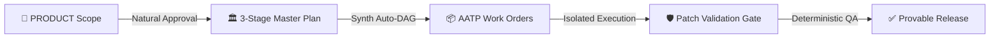

<p align="center">
  
</p>

<h1 align="center">⚡ OMP Foundry <code>v0.8.0</code></h1>

<p align="center">
  <strong>Lock the plan. Then pour the code.</strong><br/>
  <em>The Enterprise-Grade, Superpowers-Powered AI Software Foundry for <a href="https://github.com/can1357/oh-my-pi">Oh My Pi</a>.</em><br/>
  <sub>Where the architecture is <b>cryptographically locked</b>, execution is <b>micro-isolated</b>, and communication is <b>effortlessly natural</b>.</sub>
</p>

<p align="center">
  <a href="https://github.com/can1357/oh-my-pi"></a>
  <a href="https://github.com/oaichu/omp-foundry/releases/latest"></a>
  <a href="https://github.com/oaichu/omp-foundry/actions/workflows/ci.yml"></a>
  <a href="./LICENSE"></a>
  <a href="https://ko-fi.com/oaichu"></a>
</p>

---

## 🎯 The Core Philosophy: Guardrails Over Memory

Every AI coding tool is essentially a long prompt. The model *promises* not to touch your architecture, not to exceed task boundaries, not to hallucinate dependencies, and not to skip unit tests. 

Then, on a 30-file refactor, context dilutes, reasoning degrades, and it **silently rewrites your architecture**.

**OMP Foundry moves that risk out of the prompt and into a hardened, deterministic runtime gate.**



---

## 💎 What Makes Foundry `v0.8.0` Unmatched?

### 1. 🏛️ 3-Stage Master Plan Pipeline (Plan3)
* **Stage 1 — Architect (`plan-drafter`)**: Reads requirements and produces a scoped architecture draft (`docs/planning/MASTER_PLAN_DRAFT.md`).
* **Stage 2 — Adversarial Red-Team (`plan-redteam`)**: Attacks architectural assumptions, failure modes, security loopholes, and overengineering (`docs/planning/PLAN_REVIEW.md`).
* **Stage 3 — Adjudicator & Synth (`plan-synth`)**: Synthesizes conflicting recommendations into the official `docs/MASTER_PLAN.md` **and automatically decomposes the plan into initial AATP work orders (`docs/AATP/AATP-*.md`) in the same pass**.

### 2. 💬 Zero-Friction Natural Interaction
No more memorizing rigid commands. Respond naturally in conversation or use ergonomic shortcuts:
* **Natural replies accepted**: *"ok"*, *"làm đi"*, *"duyệt"*, *"tiếp tục"*, *"triển khai"*, *"làm tiếp đi"*.
* **Ergonomic Shortcuts**:
  * `/approve`: Smart approval that automatically advances current phase (Product $\rightarrow$ Plan $\rightarrow$ Build).
  * `/ok`, `/run`, `/go`: Instantly trigger the next ready execution layer.
  * `/plan`: Start/resume 3-Stage Master Plan cycle.
  * `/debug`: Systematic Superpowers 5-Step root cause isolation.

### 3. 🛡️ Low-Cost & Low-Context Model Guardrails (AATP Standards)
Strict constraints designed to make cheap/fast models perform with zero hallucinations:
* **$\le$ 200 Lines / Task**: Every work order spec is strictly bounded ($\le 200$ lines).
* **$\le$ 5 Files Working Set**: Workers are physically restricted to `allowed_files <= 5`.
* **$\le$ 80 Lines Patch Diff**: Small, atomic diffs prevent cascading regressions.
* **Three Elements Mandate**: Every task enforces **Context** $\rightarrow$ **Constraint** $\rightarrow$ **Criteria**.

### 4. 🧠 4-Tier Just-In-Time (JIT) Skill Catalog (36+ Curated Skills)
Full-stack enterprise engineering skills without token bloating:
1. **Tier 1 (Phase & Role Filter)**: Workers only receive skills relevant to their specific phase (Implementation, Review, Design).
2. **Tier 2 (Stack Detection)**: Auto-detects repository stack (FastAPI, Next.js, Cloudflare, Postgres, etc.) and prunes irrelevant stacks.
3. **Tier 3 (Thin Catalog Index)**: Only 1-line metadata headers are injected ($\approx 150$ tokens).
4. **Tier 4 (On-Demand Deep Load)**: Sub-agents fetch full detailed guides on-demand via `foundry_skill_read({ ids: [...] })`.

---

## 📋 Hard Execution Boundaries: Every Gate is Fail-Closed

| What a model might attempt... | What OMP Foundry enforces |
| :--- | :--- |
| **Rewrite locked `MASTER_PLAN` or `PRODUCT`** | ⛔ `BLOCKED: PLAN_CONFLICT. MASTER_PLAN is locked.` |
| **Edit a sealed `docs/AATP/*` work order** | ⛔ `AATP_SPEC_GATE: specs are sealed for this plan.` |
| **Patch files outside `allowed_files`** | ⛔ **Rejected before apply** — repository tree is never touched. |
| **Directory traversal via `..` or symlinks** | ⛔ `PATH_GATE: path escapes the repository boundary.` |
| **Hide mutations in shell (`sed -i`, `echo >`)** | ⛔ `BASH_GATE: arbitrary mutating shell is denied.` |
| **Run `eval`, `node -e`, `python -c`** | ⛔ `EVAL_GATE: execution denied for entire session.` |
| **Mutate code via LSP (`rename`, `codeAction`)** | ⛔ `LSP_GATE: mutating LSP actions are runtime-gated.` |
| **Self-approve its own code changes** | ⛔ Independent reviewer required + SHA-256 evidence match. |
| **`git push` / publish / deploy to production** | ⛔ `RELEASE_GATE: agent release is always denied.` |

---

## ⚡ Quickstart Guide

### 1. Installation
Link directly into Oh My Pi:

```bash
git clone https://github.com/oaichu/omp-foundry
cd omp-foundry
omp plugin link .
```

Verify the plugin is active:
```bash
omp plugin list
# ● omp-foundry@0.8.0
```

### 2. Everyday Workflow

Just one command to start or resume:

```text
/foundry <Your product or feature idea>
```

```text
1. 💡 Product Phase    → Define requirements in docs/PRODUCT.md → Type "ok" or /approve
2. 🏛️ Master Plan 3   → Draft (1/3) → Redteam (2/3) → Synth & AATP (3/3)
3. 🔒 Plan Lock        → Review docs/MASTER_PLAN.md → Type "ok" or /approve
4. ⚙️ Isolated Build   → Workers implement tasks in <= 80 line diffs
5. 🔍 Independent QA   → Deterministic verification & peer review
6. 🚀 Human Release    → Run /release-check and deploy safely from your shell
```

---

## 🎛️ Command Reference

| Command | Category | Description |
| :--- | :--- | :--- |
| `/foundry` | **Core** | Auto-bootstrap repo if needed, then resume the next step |
| `/approve` | **Natural** | Smart approval for current phase (Product or Plan) |
| `/ok` · `/run` · `/go` | **Natural** | Trigger the next ready execution layer |
| `/plan` | **Planning** | Start/resume 3-Stage Master Plan cycle |
| `/plan-revise` | **Planning** | Reopen locked plan (invalidates stale downstream DAG) |
| `/debug` | **Superpowers**| Run systematic 5-Step root cause isolation workflow |
| `/build` | **Execution**| Run ready workers from the sealed AATP DAG |
| `/review [ID]` | **Quality** | Run independent peer review for completed work order |
| `/verify` | **Quality** | Run deterministic test and verification suite |
| `/release-check` | **Release** | Derive release readiness from verifiable cryptographic evidence |
| `/foundry-doctor` | **Diagnostic**| Check worker isolation contract and model-role readiness |

---

## 🤖 Bring Your Own Models: Role Mapping

Foundry registers **ten global model roles** in `~/.omp/agent/config.yml`. You can easily configure lightweight models for drafting and heavy models for reasoning:

```yaml
# ~/.omp/agent/config.yml or .omp/config.yml
modelRoles:
  foundry_product: "@default"          # Product analysis
  foundry_plan: "gemini-2.5-flash"     # Plan drafting (Line 1)
  foundry_redteam: "claude-3-7-sonnet" # Adversarial attack (Line 2)
  foundry_synth: "claude-3-7-sonnet"   # Synthesis & AATP breakdown (Line 3)
  foundry_impl: "gemini-2.5-flash"     # Fast isolated worker (<= 5 files)
  foundry_smol: "gemini-2.5-flash"     # Trivial micro-tasks
  foundry_hard: "claude-3-7-sonnet"    # Complex algorithms / deep refactors
  foundry_review: "gemini-2.5-flash"   # Independent peer reviewer
  foundry_security: "claude-3-7-sonnet"# Security & auth reviewer
```

---

## 🧪 Verification & Test Integrity

Foundry is tested with an exhaustive test suite covering all security boundaries, AST invariants, patch gates, and runtime lifecycle hooks:

```bash
# Run the complete test suite (132 tests, 18 suites)
npx bun test

# Run TypeScript strict typecheck
npx bun run typecheck
```

```text
 132 pass
 0 fail
 445 expect() calls
Ran 132 tests across 18 files. [1.71s]
```

---

## 💖 Support the Foundry & Buy Me a Coffee

If OMP Foundry saves you from 2 a.m. architecture rewrites and powers your disciplined AI workflows, please consider supporting ongoing maintenance:

<div align="center">
  <a href="https://ko-fi.com/oaichu" target="_blank" rel="noopener noreferrer">
    
  </a>
  <br/><br/>
  <em>Every cup of coffee fuels continuous development, new workers, and governed AI tooling. Thank you! ☕✨</em>
</div>
