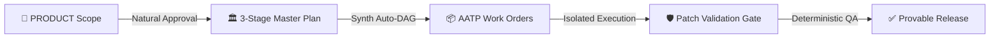

<p align="center">
  
</p>

<h1 align="center">⚡ OMP Foundry <code>v0.8.0</code></h1>

<p align="center">
  <strong>Lock the plan. Then pour the code.</strong><br/>
  <em>The Enterprise-Grade, Superpowers-Powered AI Software Foundry for <a href="https://github.com/can1357/oh-my-pi">Oh My Pi</a>.</em><br/>
  <sub>Where the architecture is <b>cryptographically locked</b>, execution is <b>micro-isolated</b>, and communication is <b>effortlessly natural</b>.</sub>
</p>

<p align="center">
  <a href="https://github.com/oaichu/omp-foundry/releases/latest"></a>
  <a href="./LICENSE"></a>
  <a href="https://ko-fi.com/oaichu"></a>
</p>

---

## 📑 Table of Contents
- [1. Who is OMP Foundry for?](#1-who-is-omp-foundry-for)
- [2. What does OMP Foundry do?](#2-what-does-omp-foundry-do)
- [3. Benefits & value](#3-benefits--value)
- [4. How does it solve the problem?](#4-how-does-it-solve-the-problem)
- [5. Everyday workflow](#5-everyday-workflow)
- [6. Installation](#6-installation)
- [7. Uninstallation](#7-uninstallation)
- [8. Command reference](#8-command-reference)
- [9. Architecture & core components](#9-architecture--core-components)
- [10. Testing & verification](#10-testing--verification)
- [11. Known limitations](#11-known-limitations)
- [12. Support the project](#12-support-the-project)

---

## 1. Who is OMP Foundry for?

> **Audience:** Anyone using **Oh My Pi (OMP)** to run AI coding agents and wanting **tight control** over what those agents produce.

Specifically:

- **Engineers / Tech Leads** who don't want an agent to silently rewrite the architecture after a 30-file refactor, exceed its task, or self-approve its own code.
- **Small teams / solo devs** using cheap (flash/mini) models but needing them to **not hallucinate** dependencies, skip tests, or touch files outside scope.
- **Product managers** who want to approve the plan and design in **natural language** ("ok", "duyệt", "làm đi") instead of memorizing commands.
- **AI agent orchestrators** who need a **fail-closed runtime** to delegate to sub-agents without losing control of the repository.

If you want an AI that writes code with no constraints → Foundry is **not** for you. If you need **provable discipline** → Foundry is the shield for OMP.

---

## 2. What does OMP Foundry do?

Foundry turns "the prompt's promise" into a **deterministic runtime gate**. Instead of trusting the agent not to touch the architecture, Foundry **blocks** every wrong action at runtime.



Four pillars:

### 🏛️ 1. 3-Stage Master Plan Pipeline (Plan3)
- **Stage 1 — Architect (`plan-drafter`)**: reads requirements → produces a scoped architecture draft (`docs/planning/MASTER_PLAN_DRAFT.md`).
- **Stage 2 — Adversarial Red-Team (`plan-redteam`)**: attacks architectural assumptions, failure modes, security loopholes, and overengineering (`docs/planning/PLAN_REVIEW.md`).
- **Stage 3 — Adjudicator & Synth (`plan-synth`)**: synthesizes conflicting recommendations into the official `docs/MASTER_PLAN.md` **and automatically decomposes the plan into initial AATP work orders (`docs/AATP/AATP-*.md`)** in the same pass.

### 💬 2. Zero-Friction Natural Interaction
No more memorizing rigid commands. Respond naturally in conversation or use ergonomic shortcuts:
- **Natural replies accepted**: *"ok"*, *"làm đi"*, *"duyệt"*, *"tiếp tục"*, *"triển khai"*.
- **Ergonomic Shortcuts**:
  - `/approve`: Smart approval that automatically advances the current phase (Product → Plan → Build).
  - `/ok`, `/run`, `/go`: Instantly trigger the next ready execution layer.
  - `/plan`: Shortcut alias for `/plan3`.

### 🛡️ 3. Low-Cost & Low-Context Model Guardrails (AATP Standards)
Strict constraints designed to make cheap/fast models perform with zero hallucinations:
- **≤ 200 Lines / Task**: Every work order spec is strictly bounded (≤ 200 lines).
- **≤ 5 Files Working Set**: Workers are physically restricted to `allowed_files <= 5`.
- **≤ 80 Lines Patch Diff**: Small, atomic diffs prevent cascading regressions.
- **Three Elements Mandate**: Every task enforces **Context** → **Constraint** → **Criteria**.

### 🧠 4. 4-Tier Just-In-Time (JIT) Skill Catalog (36+ Curated Skills)
Full-stack enterprise engineering skills without token bloating:
1. **Tier 1 (Phase & Role Filter)**: Workers only receive skills relevant to their specific phase (Implementation, Review, Design).
2. **Tier 2 (Stack Detection)**: Auto-detects repository stack (FastAPI, Next.js, Cloudflare, Postgres, etc.) and prunes irrelevant stacks.
3. **Tier 3 (Thin Catalog Index)**: Only 1-line metadata headers are injected (~150 tokens).
4. **Tier 4 (On-Demand Deep Load)**: Sub-agents fetch full detailed guides on-demand via `foundry_skill_read({ ids: [...] })`.

---

## 3. Benefits & value

| Pain point | How OMP Foundry solves it |
| :--- | :--- |
| Agent silently rewrites architecture after context dilution | `MASTER_PLAN` is **cryptographically locked**; any overwrite is rejected with `PLAN_CONFLICT` before apply. |
| Worker edits files outside its task | `PATH_GATE` + `AATP_SCOPE` allow only the exact `allowed_files`; anything else → rejected. |
| Agent self-approves its own code | Mandatory **independent reviewer** + SHA-256 evidence match. |
| Hallucinated dependencies / skipped tests | Work orders are bounded to ≤5 files, ≤200 lines, with mandatory `verification` and `acceptance`. |
| No proof of who did what | **Provenance ledger**: every commit is tied to a ticket, scope hash, and verification hash. |
| Accidental push/deploy to production | `RELEASE_GATE`: agent **release is always denied**; only a human releases. |

---

## 4. How does it solve the problem?

Core philosophy: **Guardrails Over Memory** — risk is moved out of the prompt and into a hardened, deterministic, **fail-closed** runtime gate.

### Hard Execution Boundaries — every gate is fail-closed

| What a model might attempt... | What OMP Foundry enforces |
| :--- | :--- |
| Rewrite locked `MASTER_PLAN` or `PRODUCT` | ⛔ `BLOCKED: PLAN_CONFLICT. MASTER_PLAN is locked.` |
| Edit a sealed `docs/AATP/*` work order | ⛔ `AATP_SPEC_GATE: specs are sealed for this plan.` |
| Patch files outside `allowed_files` | ⛔ **Rejected before apply** — repository tree is never touched. |
| Directory traversal via `..` or symlinks | ⛔ `PATH_GATE: path escapes the repository boundary.` |
| Hide mutations in shell (`sed -i`, `echo >`) | ⛔ `BASH_GATE: arbitrary mutating shell is denied.` |
| Run `eval`, `node -e`, `python -c` | ⛔ `EVAL_GATE: execution denied for entire session.` |
| Mutate code via LSP (`rename`, `codeAction`) | ⛔ `LSP_GATE: mutating LSP actions are runtime-gated.` |
| Self-approve its own code changes | ⛔ Independent reviewer required + SHA-256 evidence match. |
| `git push` / publish / deploy to production | ⛔ `RELEASE_GATE: agent release is always denied.` |

### Real security mechanisms (implemented in code)
- **Capability token**: each stage/compiler receives a 32-byte random token, **bound to its session** — a parent or orchestrator cannot use a leaked token → `CAPABILITY_DENIED` / `CIRCUIT_BREAKER`.
- **Path/symlink/TOCTOU defense**: `safeRepoPath` rejects `file://` schemes, control characters, and walks every path component to catch symlinks; patches are re-hashed after validation.
- **Git hardening**: strips `GIT_DIR/GIT_CONFIG*/GIT_*` redirectors, sets `core.hooksPath` → nonexistent, `GIT_CONFIG_NOSYSTEM=1`, `GIT_TERMINAL_PROMPT=0` → blocks hook/config injection.
- **Provenance ledger**: exactly matches the git history `baseline..head` against `governed_commits` — no foreign commit, no rewritten commit slips through.
- **Credential sanitization**: the verification environment uses a disposable HOME/TMP and never inherits operator secrets.

---

## 5. Everyday workflow

```text
/foundry <Your product or feature idea>
```
```text
1. 💡 Product Phase    → Define requirements in docs/PRODUCT.md → Type "ok" or /approve
2. 🏛️ Master Plan 3   → Draft (1/3) → Redteam (2/3) → Synth & AATP (3/3)
3. 🔒 Plan Lock        → Review docs/MASTER_PLAN.md → Type "ok" or /approve
4. ⚙️ Isolated Build   → Workers implement tasks in <= 80 line diffs
5. 🔍 Independent QA   → Deterministic verification & peer review
6. 🚀 Human Release    → Run /release-check and deploy safely from your shell
```

---

## 6. Installation

Foundry is an **Oh My Pi plugin/extension**. Link it directly into OMP:

```bash
git clone https://github.com/oaichu/omp-foundry
cd omp-foundry
omp plugin link .
```

Verify the plugin is active:
```bash
omp plugin list
# ● omp-foundry@0.8.0
```

When a repository is bootstrapped, Foundry automatically:
- Creates `docs/PRODUCT.md`, `docs/MASTER_PLAN.md`, `docs/DESIGN.md` (from templates).
- Writes the `docs/.foundry-governed` marker and `.omp/foundry-state.yml`.
- Adds 10 `foundry_*` model roles to `~/.omp/agent/config.yml` (without overwriting your existing choices).

> **Model configuration:** Foundry registers ten global model roles in `~/.omp/agent/config.yml`. Assign lightweight models for drafting and heavy models for reasoning:
> ```yaml
> modelRoles:
>   foundry_plan: "gemini-2.5-flash"     # Plan drafting
>   foundry_redteam: "claude-3-7-sonnet" # Adversarial attack
>   foundry_synth: "claude-3-7-sonnet"   # Synthesis & AATP
>   foundry_impl: "gemini-2.5-flash"     # Fast isolated worker
>   foundry_security: "claude-3-7-sonnet"# Security & auth reviewer
> ```

---

## 7. Uninstallation

Foundry is designed to **uninstall cleanly with no side effects** on your code.

**Step 1 — Unlink the plugin from OMP:**
```bash
omp plugin unlink omp-foundry
```

**Step 2 (optional) — Clean up configuration:**
- Remove the `foundry_*` roles from `~/.omp/agent/config.yml` (they were added automatically on install; delete manually if no longer needed).
- Remove the cloned `omp-foundry/` directory if desired.

**Step 3 (optional) — Clean up project artifacts:**
> Unlinking the plugin does **not** delete the project's governance files. If you want to remove all Foundry traces from your repo:
```bash
rm -rf docs/PRODUCT.md docs/MASTER_PLAN.md docs/DESIGN.md \
       docs/planning docs/AATP docs/reports docs/.foundry-governed \
       .omp/foundry-state.yml .omp/foundry-state.yml.* \
       .omp/config.yml
```
> ⚠️ Only run Step 3 when you are sure you no longer need the AATP planning history. `docs/PRODUCT.md` and `docs/MASTER_PLAN.md` are **product assets** — keep them if you want.

---

## 8. Command reference

| Command | Category | Description |
| :--- | :--- | :--- |
| `/foundry` | **Core** | Auto-bootstrap this repo if needed, then resume the next step |
| `/approve` | **Natural** | Smart approval for current phase (Product or Plan) |
| `/ok` · `/run` · `/go` | **Natural** | Trigger the next ready execution layer |
| `/plan` · `/plan3` | **Planning** | Start/resume 3-Stage Master Plan cycle |
| `/plan-revise` | **Planning** | Reopen locked plan (invalidates stale downstream DAG) |
| `/debug` | **Superpowers**| Run systematic 5-Step root cause isolation workflow |
| `/build` | **Execution**| Run ready isolated workers from the sealed AATP DAG |
| `/review [ID]` | **Quality** | Run independent peer review for a completed work order |
| `/verify` | **Quality** | Run deterministic test and verification suite |
| `/release-check` | **Release** | Derive release readiness from verifiable cryptographic evidence |
| `/foundry-doctor` | **Diagnostic**| Check worker isolation contract and model-role readiness |

---

## 9. Architecture & core components

| Module (`src/`) | Responsibility |
| :--- | :--- |
| `index.ts` | Registers the extension, dispatches lifecycle, capability broker, tool gates |
| `gates.ts` / `permissions.ts` | Product/plan/design approval gates & tool/file/bash/lsp blocking |
| `patch-gate.ts` | Validate, apply, commit atomic patches with TOCTOU + provenance |
| `aatp.ts` | Work-order DAG, scope/risk/coverage validation, ticket state machine |
| `plan3.ts` | Plan3 3-stage lifecycle + artifact hashing |
| `state-machine.ts` / `schema.ts` | YAML state with schema v6 migrations, fail-closed |
| `release.ts` | Provenance ledger, release derivation, governed-commit exact-match |
| `git-runtime.ts` | Git sandbox: strips env redirectors, blocks hook-path injection |
| `verify-runner.ts` | Runs verification in a disposable environment with trusted executables |
| `skills/*` | Stack detector, registry, phase/role filter, JIT resolver |

---

## 10. Testing & verification

Foundry is tested with an exhaustive suite covering all security boundaries, AST invariants, patch gates, and runtime lifecycle hooks:

```bash
# Run the complete test suite (132 tests, 18 suites)
npx bun test

# Run TypeScript strict typecheck
npx bun run typecheck
```

```text
  132 pass
  0 fail
  422 expect() calls
Ran 132 tests across 18 files.
```

> Build/typecheck was verified green (`tsc --noEmit` passes) during audit. The official test execution runs on the project's CI.

---

## 11. Known limitations

- **Verification runs repo-controlled scripts**: `/verify` and `foundry_exec` execute the repo's `scripts.test` / `scripts.build` — i.e. arbitrary repo code. The environment is credential-isolated but has **no filesystem sandbox by default**. This is a deliberate trusted-host design.
  - ✅ When auditing an untrusted repo, enable: `FOUNDRY_VERIFY_REQUIRE_SANDBOX=1` + `FOUNDRY_VERIFY_SANDBOX_EXECUTABLE=<trusted wrapper>`.
- **Android/Windows verification via `gradlew`**: the executor rejects any executable located inside the repository (to avoid running repo-supplied binaries), so the `./gradlew` steps advertised by the detector currently **cannot execute** (fail-closed and safe, but a logic gap to be addressed later).
- **Update check**: compares the installed version against the GitHub release tag and requires network access when running `/foundry-version`.

---

## 12. Support the project

If OMP Foundry saves you from 2 a.m. architecture rewrites and powers your disciplined AI workflows, please consider supporting ongoing maintenance:

<div align="center">
  <a href="https://ko-fi.com/oaichu" target="_blank" rel="noopener noreferrer">
    
  </a>
  <br/><br/>
  <em>Every cup of coffee fuels continuous development, new workers, and governed AI tooling. Thank you! ☕✨</em>
</div>

<p align="center">
  <sub>MIT License · Lock the plan. Then pour the code.</sub>
</p>
