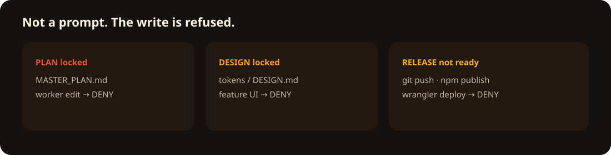
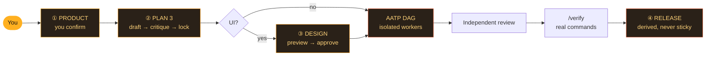

<p align="center">
  
</p>

<h1 align="center">OMP Foundry</h1>

<p align="center">
  <strong>Lock the plan. Then pour the code.</strong><br/>
  A governed AI foundry for <a href="https://github.com/can1357/oh-my-pi">Oh My Pi</a> — where the architecture is <em>locked</em>, not merely remembered.
</p>

<p align="center">
  <a href="https://github.com/can1357/oh-my-pi"></a>
  <a href="https://github.com/oaichu/omp-foundry/releases/latest"></a>
  <a href="https://github.com/oaichu/omp-foundry/actions/workflows/ci.yml"></a>
  <a href="./LICENSE"></a>
</p>

<p align="center">
  <a href="https://github.com/oaichu/omp-foundry/stargazers"></a>
  
</p>

<p align="center">
  
</p>

---

## Your agent “remembers” the architecture — until it doesn’t

Every AI coding “company” you’ve tried is a long system prompt. The model *remembers* not to rewrite the plan, not to touch the locked design, not to push before QA. Then, at 2 a.m., on a 40-file refactor, it doesn’t — and it *helpfully* rewrites your architecture.

Foundry makes that impossible, not unlikely:

```text
worker@task  edit docs/MASTER_PLAN.md
✗ BLOCKED: PLAN_CONFLICT. MASTER_PLAN is locked.
```

<p align="center">
  
</p>

Not a polite request in a prompt. A `tool_call` deny, enforced by a state machine the model cannot edit.

## What it actually is

| Layer | What you get |
| --- | --- |
| **Workflow** | Product → 3-model plan lock → design lock → AATP work orders → isolated workers → independent review → real QA → derived release |
| **Governance** | `.omp/foundry-state.yml` (schema-versioned, migrating, fail-closed) + `tool_call` denies at the execution boundary |
| **Staff** | Your models, your prices — mapped onto stock OMP roles (`@plan`, `@task`, `@smol`, `@advisor`…) |
| **Context** | LSP / grep first. No dump-the-repo. Skills are phase-aware and injected, not hoped for |

### The hard gates (real deny messages, from the source)

| The “helpful” agent tries… | Foundry answers |
| --- | --- |
| Rewrite the locked plan — via editor *or* `echo … > MASTER_PLAN.md` | `BLOCKED: PLAN_CONFLICT. MASTER_PLAN is locked.` |
| Write a file its ticket doesn’t own (`sed -i`, `tee`, `cp`, `rm` included) | `AATP_SCOPE: no active ticket allows src/billing.ts.` |
| Smuggle a write outside the repo, or through a symlinked folder | `PATH_GATE: path escapes the repository: ../outside.txt` |
| Run inline code (`node -e`, `python -c`, `eval`) | `EVAL_GATE: inline code execution is denied.` |
| Rewrite history to hide evidence (`git apply`, `git restore`, `git clean`) | `MUTATOR_GATE: cannot be verified path-by-path.` |
| Edit Foundry’s own state file | `STATE_GATE: .omp/foundry-state.yml is extension-owned.` |
| `git push` / `npm publish` / `wrangler deploy` / `vercel` / `docker push`… | `RELEASE_GATE: denied until the release gate is green at execution time.` |

And when an isolated worker *does* leak a change, Foundry reverts it **to your pre-task content** — not to HEAD — and never touches anything outside the repository.

<p align="center">
  
</p>

## Start in 30 seconds

```bash
git clone https://github.com/oaichu/omp-foundry
cd omp-foundry
omp plugin link .
```

Restart Oh My Pi, confirm with `omp plugin list`, then — this is the only command a non-coder ever needs:

```text
/foundry I want a personal finance app on Web + Android
```

Foundry drafts the product, waits for you, and walks the whole mill. You intervene at exactly four gates:



Everything between the gates runs itself: `@plan` drafts, `@default` red-teams, `@advisor` locks. Workers take one ticket each, in isolation, and cannot see the plan they’re implementing inside of.

## Everyday

Keep running **`/foundry`** after each pause — it always names the next legal step.

| Command | Use |
| --- | --- |
| `/foundry` | Next legal step (alias `/company`) |
| `/foundry-init` | Scaffold docs + state |
| `/plan3` · `/plan-revise` | Three-heat plan lock · human-only reopen |
| `/design approve` · `/design skip` | UI gate |
| `/aatp` · `/build` | Split the plan · spawn the ready layer |
| `/review` · `/verify` | Independent review · deterministic QA |
| `/release-check` | Final derived gate |
| `/foundry-version` | Installed + latest release, OMP version |

## Pour your own metals

Open **`/models` → Roles** and map whatever you already pay for — Foundry never edits plugin files, you never edit Foundry’s. Skeleton: [`roles.example.yml`](./roles.example.yml).

| Role | Foundry job |
| --- | --- |
| `default` | Floor lead — product, critique, review |
| `plan` | Architect — writes the draft |
| `advisor` | Principal — locks the plan, security review |
| `slow` | Hard pours only |
| `task` | Everyday implementation |
| `designer` | Tokens, preview, design lock |
| `smol` | Trivial AATP |

## What gets written

```text
docs/PRODUCT.md            the contract
docs/MASTER_PLAN.md        the locked plan
docs/DESIGN.md             the locked design
docs/planning/             drafts + red-team reviews
docs/AATP/                 work orders (one worker each)
docs/reports/QA.md         real command output
.omp/foundry-state.yml     the state machine (gitignored)
```

## Update · Uninstall

**Stable:** `git fetch --tags && git checkout v0.3.0` — Foundry itself tells you when a release lands (`/foundry-version`, 24h cache). Do not `git pull`; that tracks `main`.

**Developer checkout:** `git switch main && git pull`.

**Remove:** `omp plugin uninstall omp-foundry`. Not an OMP fork — Oh My Pi updates independently.

---

<p align="center">
  
</p>

<p align="center">
  <strong>Your models don’t need more freedom. They need a mold.</strong><br/>
  <sub>Built on <a href="https://github.com/can1357/oh-my-pi">Oh My Pi</a> · MIT · state machine first, prompts second</sub>
</p>

<p align="center">
  If Foundry saved you from a 2 a.m. “helpful” architecture rewrite —<br/>
  <a href="https://github.com/oaichu/omp-foundry/stargazers"></a>
</p>
