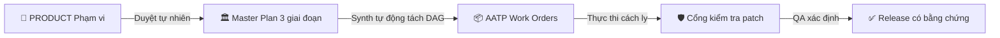

<p align="center">
  
</p>

<h1 align="center">⚡ OMP Foundry <code>v0.8.0</code></h1>

<p align="center">
  <strong>Khóa bản kế hoạch. Sau đó mới đổ code.</strong><br/>
  <em>Runtime quản trị (governed runtime) cho AI coding agent trên <a href="https://github.com/can1357/oh-my-pi">Oh My Pi</a> — nơi kiến trúc bị <b>khóa bằng mật mã</b>, thực thi bị <b>vi bản lập (micro-isolated)</b>, và giao tiếp <b>tự nhiên như nói chuyện</b>.</em>
</p>

<p align="center">
  <a href="https://github.com/oaichu/omp-foundry/releases/latest"></a>
  <a href="./LICENSE"></a>
  <a href="https://ko-fi.com/oaichu"></a>
</p>

---

## 📑 Mục lục
- [1. OMP Foundry dành cho ai?](#1-omp-foundry-dành-cho-ai)
- [2. OMP Foundry làm gì?](#2-omp-foundry-làm-gì)
- [3. Tác dụng & giá trị mang lại](#3-tác-dụng--giá-trị-mang-lại)
- [4. Giải quyết vấn đề thế nào?](#4-giải-quyết-vấn-đề-thế-nào)
- [5. Quy trình làm việc hàng ngày](#5-quy-trình-làm-việc-hàng-ngày)
- [6. Cài đặt](#6-cài-đặt)
- [7. Gỡ bỏ](#7-gỡ-bỏ)
- [8. Bảng lệnh nhanh](#8-bảng-lệnh-nhanh)
- [9. Kiến trúc & thành phần cốt lõi](#9-kiến-trúc--thành-phần-cốt-lõi)
- [10. Kiểm thử & Xác minh](#10-kiểm-thử--xác-minh)
- [11. Hạn chế đã biết](#11-hạn-chế-đã-biết)
- [12. Ủng hộ dự án](#12-ủng-hộ-dự-án)

---

## 1. OMP Foundry dành cho ai?

> **Đối tượng:** Những ai dùng **Oh My Pi (OMP)** để chạy AI coding agent và muốn **kiểm soát chặt chẽ** kết quả mà agent sinh ra.

Cụ thể:

- **Kỹ sư / Tech Lead** không muốn agent "lặng lẽ" viết lại kiến trúc sau 30 file refactor, vượt quá task, hoặc tự duyệt code của chính nó.
- **Team nhỏ / solo dev** dùng model giá rẻ (flash/mini) nhưng cần chúng **không bị ảo giác** (hallucinate) dependency, không skip test, không sửa file ngoài phạm vi.
- **Người quản lý sản phẩm (PM)** muốn duyệt kế hoạch và thiết kế bằng **ngôn ngữ tự nhiên** ("ok", "duyệt", "làm đi") thay vì học thuộc command.
- **AI agent orchestrator** cần một **runtime cửa an toàn (fail-closed)** để ủy quyền cho sub-agent mà không mất quyền kiểm soát repository.

Nếu bạn chỉ cần một AI viết code thoải mái không cần ràng buộc → Foundry **không** dành cho bạn. Nếu bạn cần **kỷ luật có thể chứng minh (provable discipline)** → Foundry là lớp khiên cho OMP.

---

## 2. OMP Foundry làm gì?

Foundry biến "lời hứa của prompt" thành một **cổng xác thực xác định (deterministic runtime gate)**. Thay vì tin agent sẽ không động vào kiến trúc, Foundry **chặn** mọi hành vi sai ngay tại runtime.



Bốn trụ cột:

### 🏛️ 1. Master Plan 3 giai đoạn (Plan3)
- **Giai đoạn 1 — Architect (`plan-drafter`)**: đọc yêu cầu → phác thảo kiến trúc (`docs/planning/MASTER_PLAN_DRAFT.md`).
- **Giai đoạn 2 — Red-Team (`plan-redteam`)**: tấn công giả định kiến trúc, failure mode, lỗ hổng bảo mật, over-engineering (`docs/planning/PLAN_REVIEW.md`).
- **Giai đoạn 3 — Adjudicator & Synth (`plan-synth`)**: hợp nhất → `docs/MASTER_PLAN.md` **và tự động tách** thành các work order AATP (`docs/AATP/AATP-*.md`) trong cùng một lượt.

### 💬 2. Tương tác tự nhiên, zero-friction
Không cần nhớ command cứng nhắc. Phản hồi tự nhiên: *"ok"*, *"làm đi"*, *"duyệt"*, *"tiếp tục"*, *"triển khai"*. Hoặc shortcut:
- `/approve` — duyệt thông minh, tự tiến giai đoạn (Product → Plan → Build).
- `/ok`, `/run`, `/go` — chạy lớp thực thi sẵn sàng tiếp theo.
- `/plan` — alias của `/plan3`.

### 🛡️ 3. Guardrails cho model giá rẻ (AATP Standards)
Ràng buộc để model rẻ/nhanh hoạt động **không ảo giác**:
- **≤ 200 dòng / task** — mỗi work order bị giới hạn nghiêm ngặt.
- **≤ 5 file working set** — worker bị giới hạn vật lý `allowed_files <= 5`.
- **≤ 80 dòng patch diff** — diff nguyên tử nhỏ, tránh regression dây chuyền.
- **Ba yếu tố bắt buộc**: Context → Constraint → Criteria.

### 🧠 4. Danh mục kỹ năng JIT 4 tầng (36+ skills)
Đầy đủ kỹ năng full-stack enterprise mà không phình token:
1. **Tầng 1 (lọc theo phase/role)**: worker chỉ nhận skill đúng giai đoạn.
2. **Tầng 2 (phát hiện stack)**: tự phát hiện repo (FastAPI, Next.js, Cloudflare, Postgres…) và cắt stack không liên quan.
3. **Tầng 3 (chỉ mục mỏng)**: chỉ tiêm metadata 1 dòng (~150 token).
4. **Tầng 4 (tải sâu theo yêu cầu)**: sub-agent lấy nội dung chi tiết qua `foundry_skill_read({ ids: [...] })`.

---

## 3. Tác dụng & giá trị mang lại

| Nỗi đau | OMP Foundry giải quyết bằng |
| :--- | :--- |
| Agent lặng lẽ viết lại kiến trúc sau context dilution | `MASTER_PLAN` bị **khóa mật mã**; mọi ghi đè bị `PLAN_CONFLICT` từ chối trước khi apply. |
| Worker sửa file ngoài task | `PATH_GATE` + `AATP_SCOPE` chỉ cho phép đúng `allowed_files`; vượt quá → rejected. |
| Agent tự duyệt code của chính nó | Bắt buộc **reviewer độc lập** + khớp SHA-256 evidence. |
| Ảo giác dependency / skip test | Work order bị giới hạn ≤5 file, ≤200 dòng, có `verification` và `acceptance` bắt buộc. |
| Không chứng minh được ai làm gì | **Provenance ledger**: mỗi commit được gắn với ticket, scope hash, verification hash. |
| Push/deploy nhầm lên production | `RELEASE_GATE`: agent **luôn bị từ chối** publish/push; chỉ người mới release. |

---

## 4. Giải quyết vấn đề thế nào?

Triết lý cốt lõi: **Guardrails Over Memory** — rủi ro được đẩy ra khỏi prompt, vào một **runtime cửa an toàn (fail-closed)** được mã hóa cứng.

### Các cổng thực thi — mọi cổng đều fail-closed

| Agent có thể cố… | Foundry thực thi |
| :--- | :--- |
| Ghi đè `MASTER_PLAN`/`PRODUCT` đã khóa | ⛔ `BLOCKED: PLAN_CONFLICT. MASTER_PLAN is locked.` |
| Sửa work order AATP đã niêm phong | ⛔ `AATP_SPEC_GATE: specs are sealed for this plan.` |
| Patch file ngoài `allowed_files` | ⛔ **Bị từ chối trước khi chạm cây repo** — tree không bao giờ bị động. |
| Directory traversal (`..`, symlink) | ⛔ `PATH_GATE: path escapes the repository boundary.` |
| Giấu mutation trong shell (`sed -i`, `echo >`) | ⛔ `BASH_GATE: arbitrary mutating shell is denied.` |
| Chạy `eval`, `node -e`, `python -c` | ⛔ `EVAL_GATE: execution denied for entire session.` |
| Tự duyệt code của chính mình | ⛔ Reviewer độc lập bắt buộc + SHA-256 evidence match. |
| `git push` / publish / deploy | ⛔ `RELEASE_GATE: agent release is always denied.` |

### Cơ chế bảo mật thực tế (đã implement trong code)
- **Capability token**: mỗi stage/compiler nhận token 32-byte random, **buộc theo session** — parent/orchestrator không dùng được token rò rỉ → `CAPABILITY_DENIED` / `CIRCUIT_BREAKER`.
- **Chống path/symlink/TOCTOU**: `safeRepoPath` từ chối scheme `file://`, ký tự điều khiển, và duyệt từng thành phần bắt symlink; patch được re-hash sau validation.
- **Git hardening**: tước `GIT_DIR/GIT_CONFIG*/GIT_*` redirectors, set `core.hooksPath` → nonexistent, `GIT_CONFIG_NOSYSTEM=1`, `GIT_TERMINAL_PROMPT=0` → chặn hook/config injection.
- **Provenance ledger**: so khớp chính xác lịch sử git `baseline..head` với `governed_commits` — không commit lạ, không commit bị viết lại.
- **Credential sanitize**: môi trường verify dùng HOME/TMP disposable, không kế thừa secret operator.

---

## 5. Quy trình làm việc hàng ngày

```text
/foundry <ý tưởng sản phẩm hoặc tính năng>
```
```text
1. 💡 Product Phase   → Định nghĩa yêu cầu trong docs/PRODUCT.md → Gõ "ok" hoặc /approve
2. 🏛️ Master Plan 3  → Draft (1/3) → Redteam (2/3) → Synth & AATP (3/3)
3. 🔒 Plan Lock       → Xem docs/MASTER_PLAN.md → "ok" hoặc /approve
4. ⚙️ Isolated Build  → Worker thực thi trong diff ≤ 80 dòng
5. 🔍 Independent QA  → Xác minh xác định & peer review độc lập
6. 🚀 Human Release   → Chạy /release-check, rồi deploy từ shell của bạn
```

---

## 6. Cài đặt

Foundry là một **plugin/extension của Oh My Pi**. Link trực tiếp vào OMP:

```bash
git clone https://github.com/oaichu/omp-foundry
cd omp-foundry
omp plugin link .
```

Xác nhận plugin đã active:
```bash
omp plugin list
# ● omp-foundry@0.8.0
```

Khi một repo được khởi tạo, Foundry tự động:
- Tạo `docs/PRODUCT.md`, `docs/MASTER_PLAN.md`, `docs/DESIGN.md` (từ template).
- Ghi marker `docs/.foundry-governed` và `.omp/foundry-state.yml`.
- Thêm 10 role model `foundry_*` vào `~/.omp/agent/config.yml` (không ghi đè lựa chọn có sẵn của bạn).

> Cấu hình model: Foundry đăng ký 10 role toàn cục trong `~/.omp/agent/config.yml`. Bạn gán model nhẹ cho drafting, model nặng cho reasoning:
> ```yaml
> modelRoles:
>   foundry_plan: "gemini-2.5-flash"     # Plan drafting
>   foundry_redteam: "claude-3-7-sonnet" # Adversarial attack
>   foundry_synth: "claude-3-7-sonnet"   # Synthesis & AATP
>   foundry_impl: "gemini-2.5-flash"     # Fast isolated worker
>   foundry_security: "claude-3-7-sonnet"# Security & auth reviewer
> ```

---

## 7. Gỡ bỏ

Foundry được thiết kế để **gỡ sạch không để lại side-effect** lên code của bạn.

**Bước 1 — Gỡ plugin khỏi OMP:**
```bash
omp plugin unlink omp-foundry
```

**Bước 2 (tùy chọn) — Dọn dẹp cấu hình:**
- Xóa các role `foundry_*` khỏi `~/.omp/agent/config.yml` (chúng được thêm tự động khi cài; xóa thủ công nếu không dùng nữa).
- Xóa thư mục repo clone `omp-foundry/` nếu muốn.

**Bước 3 (tùy chọn) — Dọn dẹp artifact trong project:**
> Gỡ plugin **không** xóa file governance của project. Nếu muốn xóa hoàn toàn dấu vết Foundry trong repo của bạn:
```bash
rm -rf docs/PRODUCT.md docs/MASTER_PLAN.md docs/DESIGN.md \
       docs/planning docs/AATP docs/reports docs/.foundry-governed \
       .omp/foundry-state.yml .omp/foundry-state.yml.* \
       .omp/config.yml
```
> ⚠️ Chỉ chạy bước 3 khi bạn chắc chắn không cần lịch sử kế hoạch AATP nữa. Các file `docs/PRODUCT.md`, `docs/MASTER_PLAN.md` là **tài sản sản phẩm** — giữ lại nếu muốn.

---

## 8. Bảng lệnh nhanh

| Lệnh | Nhóm | Mô tả |
| :--- | :--- | :--- |
| `/foundry` | **Core** | Tự bootstrap repo nếu cần, rồi tiếp bước hợp lệ tiếp theo |
| `/approve` | **Natural** | Duyệt thông minh cho giai đoạn hiện tại (Product hoặc Plan) |
| `/ok` · `/run` · `/go` | **Natural** | Kích hoạt lớp thực thi sẵn sàng tiếp theo |
| `/plan` · `/plan3` | **Planning** | Bắt đầu/tiếp tục chu trình Master Plan 3 giai đoạn |
| `/plan-revise` | **Planning** | Mở lại plan đã khóa (vô hiệu hóa DAG downstream cũ) |
| `/debug` | **Superpowers**| Chạy quy trình debug 5 bước có hệ thống |
| `/build` | **Execution**| Chạy worker cách ly từ DAG AATP đã niêm phong |
| `/review [ID]` | **Quality** | Chạy peer review độc lập cho work order hoàn thành |
| `/verify` | **Quality** | Chạy bộ xác minh xác định (QA) |
| `/release-check` | **Release** | Rút ra độ sẵn sàng release từ bằng chứng mật mã |
| `/foundry-doctor` | **Diagnostic**| Kiểm tra hợp đồng cách ly worker & sẵn sàng role model |

---

## 9. Kiến trúc & thành phần cốt lõi

| Module (`src/`) | Trách nhiệm |
| :--- | :--- |
| `index.ts` | Đăng ký extension, dispatch lifecycle, capability broker, các cổng tool |
| `gates.ts` / `permissions.ts` | Cổng duyệt product/plan/design & chặn tool/file/bash/lsp |
| `patch-gate.ts` | Validate, apply, commit patch nguyên tử có TOCTOU + provenance |
| `aatp.ts` | Work-order DAG, validate scope/risk/coverage, ticket state machine |
| `plan3.ts` | Vòng đời 3 giai đoạn Plan3 + artifact hashing |
| `state-machine.ts` / `schema.ts` | State YAML có migration schema v6, fail-closed |
| `release.ts` | Provenance ledger, release derivation, governed-commit exact-match |
| `git-runtime.ts` | Git sandbox: tước env redirectors, hook-path injection block |
| `verify-runner.ts` | Thực thi verify trong môi trường disposable, executable trusted |
| `skills/*` | Detector stack, registry, phase/role filter, JIT resolver |

---

## 10. Kiểm thử & Xác minh

Foundry được bao phủ bởi bộ test chuyên sâu cho mọi boundary bảo mật, bất biến AST, patch gate và lifecycle hook:

```bash
# Chạy toàn bộ test suite (132 tests, 18 suites)
npx bun test

# Typecheck strict (TypeScript strict + noUnusedLocals/Parameters)
npx bun run typecheck
```

```text
  132 pass
  0 fail
  422 expect() calls
Ran 132 tests across 18 files.
```

> Build/typecheck đã được xác minh xanh (`tsc --noEmit` qua) trong quá trình audit. Test execution chính thức chạy trên CI của dự án.

---

## 11. Hạn chế đã biết

- **Verification chạy code do repo kiểm soát**: `/verify` và `foundry_exec` thực thi `scripts.test`/`scripts.build` của repo — tức chạy code tùy ý của repo. Môi trường được cách ly credential nhưng **không có filesystem sandbox mặc định**. Đây là thiết kế trusted-host có chủ đích.
  - ✅ Khi audit repo không tin cậy, bật: `FOUNDRY_VERIFY_REQUIRE_SANDBOX=1` + `FOUNDRY_VERIFY_SANDBOX_EXECUTABLE=<wrapper tin cậy>`.
- **Verify Android/Windows qua `gradlew`**: executor từ chối mọi executable nằm trong repo (để tránh chạy binary do repo cung cấp), nên các step `./gradlew` được detector quảng cáo hiện **không thể thực thi** (fail-closed, an toàn, nhưng là gap logic sẽ được sửa sau).
- **Update-check**: so sánh version cài đặt với tag release trên GitHub; cần quyền mạng khi chạy `/foundry-version`.

---

## 12. Ủng hộ dự án

Nếu OMP Foundry cứu bạn khỏi những lần viết lại kiến trúc lúc 2 giờ sáng và cấp quy trình AI có kỷ luật, hãy ủng hộ duy trì:

<div align="center">
  <a href="https://ko-fi.com/oaichu" target="_blank" rel="noopener noreferrer">
    
  </a>
  <br/><br/>
  <em>Mỗi ly cà phê tiếp sức phát triển liên tục, thêm worker, và công cụ AI có quản trị. Cảm ơn bạn! ☕✨</em>
</div>

<p align="center">
  <sub>MIT License · Lock the plan. Then pour the code.</sub>
</p>
