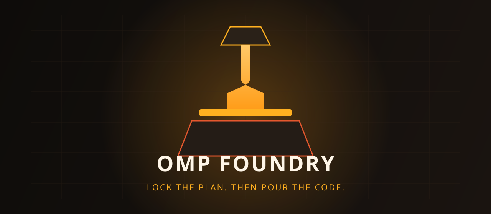
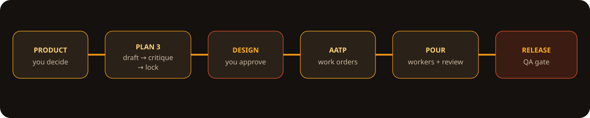
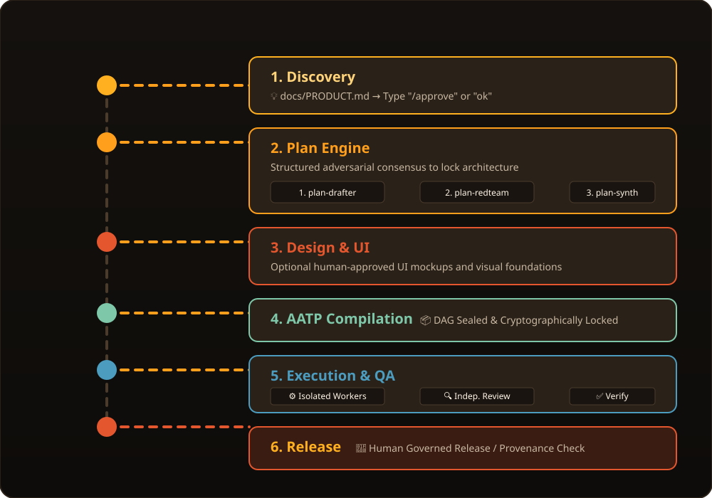

<p align="center">
  
</p>

<p align="center">
  <strong>The Enterprise-Grade AI Software Engineering Framework for <a href="https://github.com/can1357/oh-my-pi">Oh My Pi</a> & Antigravity</strong><br/>
  <em>Where architecture is <b>cryptographically locked</b>, execution is <b>micro-isolated</b>, and human intent remains <b>absolute</b>.</em>
</p>

<p align="center">
  <a href="https://github.com/oaichu/omp-foundry/releases/latest"></a>
  <a href="https://github.com/can1357/oh-my-pi"></a>
  <a href="#"></a>
  <a href="./LICENSE"></a>
  <a href="https://ko-fi.com/oaichu"></a>
</p>

---

## 🌟 The Broken Promise of AI Coding (And How We Fix It)

> **The Nightmare:** You ask your AI assistant to build a feature. It writes 500 lines of code. It breaks three existing components. You spend 2 hours debugging its hallucinations. After 10 prompts, it forgets the original architecture and starts producing spaghetti code. You realize you are not a manager—you are babysitting a junior developer with severe amnesia.

> **The Deep Desire:** You want an AI that acts like a **disciplined engineering team**. You want to dictate the product vision, lock the architecture, and let the AI flawlessly execute isolated micro-tasks without *ever* regressing existing code. You want your natural language to be the **absolute, unquestionable final command**.

**OMP Foundry** is the paradigm shift. Unlike standard AI tools that give models unbounded access to mutate your entire codebase, Foundry introduces **Zero-Regression Governance**. It converts your prompts into a 3-Stage Adversarial Plan, breaks work into cryptographically-locked micro-tasks, and sandboxes workers so they physically cannot break what already works.

You are no longer an AI babysitter. **You are the Chief Architect.**

<p align="center">
  
</p>

---
## 📑 Table of Contents

- [⚡ Why OMP Foundry?](#-why-omp-foundry)
- [💎 Core Architectural Superpowers](#-core-architectural-superpowers)
- [🔄 The 6-Phase Governed Lifecycle](#-the-6-phase-governed-lifecycle)
- [🛡️ Security & Hard Execution Boundaries](#️-security--hard-execution-boundaries)
- [🚀 30-Second Quickstart](#-30-second-quickstart)
- [⌨️ Complete Command Reference](#️-complete-command-reference)
- [🧠 4-Tier Just-In-Time (JIT) Skill Catalog](#-4-tier-just-in-time-jit-skill-catalog)
- [🧩 Architecture & Codebase Map](#-architecture--codebase-map)
- [🧪 Verification & Test Suite](#-verification--test-suite)
- [💖 Back the Project](#-back-the-project)

---

## ⚡ Why OMP Foundry?

| Pain Point in AI Coding | How Raw Agents Fail | How OMP Foundry Solves It |
| :--- | :--- | :--- |
| **Architectural Drift** | Modifies core schemas mid-task after forgetting initial plan | **Cryptographic Lock**: `MASTER_PLAN.md` is hashed with SHA-256; unauthorized agent edits trigger `PLAN_CONFLICT`. |
| **Cascading Regressions** | Rewrites 20+ files at once with sprawling 500-line diffs | **Atomic Patch Gate**: Strictly enforces `≤ 80` line unified diffs within predefined `allowed_files` (max 5). |
| **Self-Approved Hallucinations** | Agent marks its own broken code as "completed" | **Independent Peer Review**: Code must pass an independent reviewer agent + exact verification hashes. |
| **Rigid / Clunky UX** | Requires typing exact, obscure slash commands | **Natural Interaction**: Reply casually (*"ok"*, *"duyệt"*, *"làm đi"*), or use smart `/approve` shortcuts. |
| **Offline Sealing Bottlenecks** | Subagents stall or timeout generating huge DAGs | **Instant Transplant & Seal**: Fast manual transplant via `cp` + instant verification with `/aatp-seal`. |
| **Accidental Production Breakage**| Agent pushes unverified code directly to git/deploy | **Human Release Gate**: Code releases require derived provenance proofs and human authorization. |

---

## 💎 Core Architectural Superpowers

### 👑 The Human Is The Ultimate Boss
Unlike other rigid frameworks that force you to learn their DSLs or fight their guardrails, **Foundry bows to human authority**. You don't need to be a coder. If the human dictates an architecture change, skips a phase, or overrides a rule via natural language (*"ok"*, *"duyệt"*, *"làm đi"*), **Foundry executes it immediately**. The machine proposes; the human disposes.

### 🏛️ 1. Plan: 3-Stage Adversarial Planning
Instead of letting a single LLM hallucinate architecture in one prompt, Foundry runs a structured, adversarial consensus:
1. **Architect (`plan-drafter`)**: Derives a scoped structural proposal (`docs/planning/MASTER_PLAN_DRAFT.md`).
2. **Red Team (`plan-redteam`)**: Attacks architectural assumptions, edge cases, scalability limits, and security vulnerabilities (`docs/planning/PLAN_REVIEW.md`).
3. **Adjudicator & Synth (`plan-synth`)**: Synthesizes conflicting recommendations into `docs/MASTER_PLAN.md` and generates initial AATP work orders.

### ⚡ 2. Absolute Human Sovereignty & Natural UX
- **Natural Language Triggers**: The orchestrator understands conversational intent. Type *"ok"*, *"proceed"*, *"do it"*, or *"approve"* to approve phases.
- **Smart Ergonomic Aliases**:
  - `/approve`: Context-aware single shortcut that advances Product → Plan → Design → Build.
  - `/ok` · `/run` · `/go`: Instantly triggers the next ready execution layer.
  - `/aatp-seal`: Instant 1-second DAG audit & sealing for offline-generated or transplanted work orders.

### 🛡️ 3. AATP (Atomic Architecture Task Protocol)
- **≤ 200 Lines / Task**: Every work order is tightly scoped and readable in a single context pass.
- **≤ 5 Files Working Set**: Subagents are physically sandboxed to `allowed_files`.
- **≤ 80 Lines Diff Cap**: Large changes must be broken into provable, bite-sized commits.
- **Strict Provenance Ledger**: Every git commit is tied to an active ticket, scope hash, and verification test run.

---

## 🔄 The 6-Phase Governed Lifecycle

<p align="center">
  
</p>

---

## 🛡️ Security & Hard Execution Boundaries

<p align="center">
  
</p>

Foundry enforces **fail-closed runtime boundaries**:

- **Cryptographic Capability Broker**: Ephemeral 32-byte cryptographic tokens prevent rogue or parent-leaked subagent mutations.
- **Path Escape & Symlink Defense**: Strict canonicalization blocks path traversal (`..`), symlink escapes, and out-of-tree writes.
- **Clean Tree Guarantees**: Workers cannot mutate uncommitted dirty worktrees, preserving git integrity.
- **Sanitized QA Sandboxing**: The verification runner executes package test scripts in a clean environment without leaking operator credentials.

---

## 🚀 30-Second Quickstart

### 1. Install & Link Plugin
<p align="center">
  
</p>

### 2. Initialize a Project
In any project repository, run:
```text
/foundry Build a high-performance REST API in FastAPI with PostgreSQL
```

### 3. Move with Natural Flow
```text
1. 💡 Review requirements in docs/PRODUCT.md  → Type "ok" or /approve
2. 🏛️ Plan runs (Draft → Redteam → Synth)     → Type "ok" or /approve
3. 📦 AATP DAG compiles work orders           → Type /build
4. ⚙️ Workers code in isolated <=80 line diffs → Type /verify
5. 🚀 Check release readiness                 → Type /release-check
```

---

## ⌨️ Complete Command Reference

| Command | Category | Purpose |
| :--- | :--- | :--- |
| **`/foundry [prompt]`** | **Core** | Auto-bootstraps project governance or resumes the next logical step. |
| **`/approve`** | **Ergonomics** | Smart context-aware approval for Product, Plan, and Design gates. |
| **`/ok` · `/run` · `/go`** | **Ergonomics** | Natural conversation shortcuts to trigger the next execution layer. |
| **`/plan`** | **Planning** | Start or resume the 3-Stage Master Plan consensus engine. |
| **`/plan-revise`** | **Planning** | Human-only command to unlock the master plan and safely re-plan. |
| **`/aatp`** | **AATP** | Spawns the synthesis compiler to generate the project-wide dependency DAG. |
| **`/aatp-seal`** | **AATP** | **Instant 1-second seal** for manual transplants or pre-generated DAGs. |
| **`/build`** | **Execution** | Dispatches ready, isolated workers to implement active tickets. |
| **`/review [ID]`** | **Quality** | Triggers an independent reviewer agent to verify code against tickets. |
| **`/verify`** | **Quality** | Runs deterministic test and QA scripts in a sanitized environment. |
| **`/release-check`** | **Release** | Computes cryptographic provenance and derives deployment readiness. |
| **`/debug`** | **Superpowers** | Executes the systematic 5-Step root-cause isolation protocol. |
| **`/foundry-doctor`** | **Diagnostics**| Validates worker isolation contracts and model-role health. |
| **`/foundry-version`** | **System** | Checks current version and updates from GitHub releases. |

---

## 🧠 4-Tier Just-In-Time (JIT) Skill Catalog

Foundry packages **36+ enterprise engineering skills** without bloating your model's context window:

<p align="center">
  
</p>

---

## 🧩 Architecture & Codebase Map

<p align="center">
  
</p>

---

## 🧪 Verification & Test Suite

OMP Foundry is backed by an exhaustive, green-field integration test suite ensuring zero regressions:

<p align="center">
  
</p>

---

## 💖 Back the Project

If OMP Foundry saves you from 2:00 AM architecture regressions and powers disciplined, predictable AI workflows, consider supporting continuous development:

<div align="center">
  <a href="https://ko-fi.com/oaichu" target="_blank" rel="noopener noreferrer">
    
  </a>
  <br/><br/>
  <em>Every coffee fuels ongoing development of zero-regression agent tooling. Thank you! ☕✨</em>
</div>

<p align="center">
  <sub>MIT License · © 2026 OMP Foundry Contributors · <strong>Lock the plan. Then pour the code.</strong></sub>
</p>
