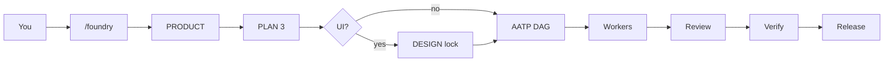

<p align="center">
  
</p>

<h1 align="center">OMP Foundry</h1>

<p align="center">
  <strong>Lock the plan. Then pour the code.</strong><br/>
  A governed AI foundry for <a href="https://github.com/can1357/oh-my-pi">Oh My Pi</a> — not another “act like a software company” prompt.
</p>

<p align="center">
  <a href="https://github.com/can1357/oh-my-pi"></a>
  <a href="./LICENSE"></a>
  
</p>

<p align="center">
  
</p>

You assign models to roles. Foundry runs the mill.

> **v0.2.2.** Tool-execution boundary inside Oh My Pi, not an OS sandbox. State files carry `schema_version`. Missing version is legacy v0 and migrates deterministically; newer schemas fail closed. `eval` is denied for the whole Foundry session. Paths are canonicalized under the repo root. QA only PASSes on a **clean** working tree bound to `HEAD`. Release also requires every ticket `review=APPROVE`. Isolated implementers (including `smol-implementer`) are forced on `/build`.


```text
/foundry I want a personal finance app on Web + Android
```

That is the only command a non-coder needs.

<p align="center">
  
</p>

## Why this exists

Most agent “companies” are a long system prompt. The model *remembers* not to rewrite the architecture — until it doesn’t.

Foundry is a **state machine + hard gates**:

| Layer | What it actually is |
| --- | --- |
| Workflow | Product → 3-model plan lock → design lock → AATP → workers → review → real QA → release |
| Staff | Your models, mapped onto stock OMP roles |
| Governance | `.omp/foundry-state.yml` + `tool_call` deny |
| Context | LSP / grep first. No dump-the-repo. |

<p align="center">
  
</p>

A worker cannot “just refactor the plan.” The write is blocked.

## Install

```bash
git clone https://github.com/oaichu/omp-foundry
cd omp-foundry
omp plugin link .
```

Restart Oh My Pi. Confirm:

```bash
omp plugin list
```

You want `omp-foundry` in the list.

## One-time: pour your own metals

Open **`/models` → Roles**. Map whatever you pay for. Do not edit plugin files.

| Role | Foundry job |
| --- | --- |
| `default` | Floor lead — product, critique, review |
| `plan` | Architect — writes the draft |
| `advisor` | Principal — locks the plan, security review |
| `slow` | Hard pours only |
| `task` | Everyday implementation |
| `designer` | Tokens, preview, design lock |
| `smol` | Trivial AATP |

Copy-paste skeleton: [`roles.example.yml`](./roles.example.yml).

## Everyday

Keep running **`/foundry`** after each pause.

1. `docs/PRODUCT.md` — you confirm the product  
2. `@plan` drafts → `@default` red-teams → `@advisor` locks `docs/MASTER_PLAN.md`  
3. If the stack has UI: preview, then `/design approve` or `/design skip`  
4. Plan becomes `docs/AATP/*` work orders  
5. `@task` / `@slow` implement one ticket each  
6. Independent review. Security-critical → `@advisor`  
7. `/verify` runs **real** test/build commands  
8. `/release-check` — until green, `git push` / `npm publish` / `wrangler deploy` stay denied  

You intervene at four gates: **product**, **plan lock**, **design approve**, **release**.



## Extra levers

| Command | Use |
| --- | --- |
| `/foundry` | Next legal step |
| `/foundry-init` / `/company-init` | Force scaffold |
| `/plan3` | Force draft → critique → lock |
| `/design` `/design approve` `/design skip` | UI gate |
| `/aatp` | Split the locked plan |
| `/build` | Next independent AATP layer |
| `/review` | Review a finished ticket |
| `/verify` | Deterministic QA |
| `/release-check` | Final gate |

`/company` remains an alias of `/foundry`.

Built-in Oh My Pi Plan (Shift+Tab) is untouched: one `@plan` model. `/plan3` is the three-heat lock.

## What gets written

```text
docs/PRODUCT.md
docs/MASTER_PLAN.md
docs/DESIGN.md
docs/planning/MASTER_PLAN_DRAFT.md
docs/planning/PLAN_REVIEW.md
docs/AATP/
docs/reports/
.omp/foundry-state.yml
```

## Uninstall

```bash
omp plugin uninstall omp-foundry
```

Not an OMP fork. Update Oh My Pi independently; `git pull` this plugin independently.

---

If Foundry saved you from an agent that “helpfully” rewrote the architecture — star the repo so the next person finds the lock before the pour.
